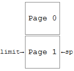
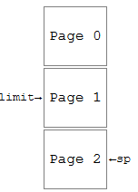

# CSE-460-Operating-Systems

**Course Description:** 

CSE 460 covers basic OS design and implementation concepts through the coverage of selected topics in the text, and the design and implementation of a simple 16-bit GPU running a simple OS as the on-going project in the lab. In both lecture and lab, we will cover process management and memory management in detail. In the lecture we also cover process synchronization, multi-threading, deadlocks, etc. 

The project consists of three phases: 
1. CPU/Assembler
2. Process Management
3.  Memory Management 

Where each phase approximately takes three weeks.

# **Phase 1:**

Write a C++ program to simulate a simple 16-bit CPU (Virtual Machine). VM consists of 4 General Purpose Registers (r[0]-r[3]) a Program Counter (pc), an Instruction Register (ir), a Status Register (sr), a Stack Pointer (sp), a Clock (clock), an Arithmetic and Logic Unit (ALU), a 256 word Memory (mem with base and limit registers), and a Disk.

Represent General Purpose Registers with a vector of 4 integers, mem with a vector of 256 integers, pc with an integer, ir with an integer, ...

```
           class VirtualMachine {
           private:
               int msize;
               int rsize;
               int pc, ir, sr, sp, clock;
               vector<int> mem;
               vector<int> r;
               int base, limit;
           public:
               VirtualMachine(): msize(256), rsize(4), clock(0) 
               { 
                   mem = vector<int>(msize); 
                   r = vector<int>(rsize); 
               }
           ...
           };
```


Since this is a 16-bit machine, we only use the lower 16 bits of the variables. The least significant five bits of sr are reserved for OVERFLOW, LESS, EQUAL, GREATER, and CARRY in that order, the rest are "don't-care" (d): 

|d|...|d|V|L|E|G|C|
|--- |--- |--- |--- |--- |--- |--- |--- |
|15|&nbsp;|5|4|3|2|1|0|

ALU is part of the logic of your program, and disk is represented by a collection of files. clock could be alternatively represented by a class.

VM supports two instruction formats.

## *Format 1:* 

|OP|RD|I|RS|UNUSED|
|--- |--- |--- |--- |--- |
|15:11|10:9|8|7:6|5:0|

## *Format 2:*

|OP|RD|I|ADDR/CONST|
|--- |--- |--- |--- |
|15:11|10:9|8|7:0|

where OP (bits 11 to 15 from right to left) stands for opcode,
RD (bits 9 and 10) stands for register-destination,
I (bit 8) stands for immediate,
and RS (bits 6 and 7) stands for register-source.

When I is 0, the next 2 bits specify the source register and the next 6 bits are unused.
When I is 1, immediate address mode is in effect: depending on the instruction, the next 8 bits are treated as either an unsigned 8 bit address (ADDR), or an 8 bit two's complement constant (CONST). This implies 0 <= ADDR < 256 and -128 <= CONST < 128.

load and loadi are special instructions, they both use format 2: when I = 0, we use ADDR, when I = 1, we use CONST.

If a field is unused, it is considered don't-care, and it can be set to any bit pattern, but in this project we will set don't-cares to all zeros.

To simplify writing programs for the VM, we need an assembly language and its corresponding assembler. The following table lists all instructions supported by the Assembler and in turn VM. 

## *VM Instruction Set:*

|OP|I|Instruction|Semantic in Pseudo C++ Syntax|Additional Action|
|--- |--- |--- |--- |--- |
|00000|0|load RD ADDR|r[RD] = mem[ADDR]||
|00000|1|loadi RD CONST|r[RD] = CONST||
|00001|1|store RD ADDR|mem[ADDR] = r[RD]||
|00010|0|add RD RS|r[RD] = r[RD] + r[RS]|Set CARRY|
|00010|1|addi RD CONST|r[RD] = r[RD] + CONST|Set CARRY|
|00011|0|addc RD RS|r[RD] = r[RD] + r[RS] + CARRY|Set CARRY|
|00011|1|addci RD CONST|r[RD] = r[RD] + CONST + CARRY|Set CARRY|
|00100|0|sub RD RS|r[RD] = r[RD] - r[RS]|Set CARRY|
|00100|1|subi RD CONST|r[RD] = r[RD] - CONST|Set CARRY|
|00101|0|subc RD RS|r[RD] = r[RD] - r[RS] - CARRY|Set CARRY|
|00101|1|subci RD CONST|r[RD] = r[RD] - CONST - CARRY|Set CARRY|
|00110|0|and RD RS|r[RD] = r[RD] & r[RS]||
|00110|1|andi RD CONST|r[RD] = r[RD] & CONST||
|00111|0|xor RD RS|r[RD] = r[RD] ^ r[RS]||
|00111|1|xori RD CONST|r[RD] = r[RD] ^ CONST||
|01000|d|compl RD|r[RD] = ~ r[RD]||
|01001|d|shl RD|r[RD] = r[RD] << 1, shift-in-bit = 0|Set CARRY|
|01010|d|shla RD|shl arithmetic|Set CARRY & Sign Extend|
|01011|d|shr RD|r[RD] = r[RD] >> 1, shift-in-bit = 0|Set CARRY|
|01100|d|shra RD|shr arithmetic|Set CARRY & Sign Extend|
|01101|0|compr RD RS|if r[RD] < r[RS] set LESS reset EQUAL and GREATER;<br />if r[RD] == r[RS] set EQUAL reset LESS and GREATER;<br />if r[RD] > r[RS] set GREATER reset EQUAL and LESS||
|01101|1|compri RD CONST|if r[RD] < CONST set LESS reset EQUAL and GREATER;<br />if r[RD] == CONST set EQUAL reset LESS and GREATER;<br />if r[RD] > CONST set GREATER reset EQUAL and LESS||
|01110|d|getstat RD|r[RD] = SR||
|01111|d|putstat RD|SR = r[RD]||
|10000|1|jump  ADDR|pc = ADDR||
|10001|1|jumpl ADDR|if LESS == 1, pc = ADDR, else do nothing||
|10010|1|jumpe ADDR|if EQUAL == 1, pc = ADDR, else do nothing||
|10011|1|jumpg ADDR|if GREATER == 1, pc = ADDR, else do nothing||
|10100|1|call ADDR|push VM status; pc = ADDR||
|10101|d|return|pop and restore VM status||
|10110|d|read RD|read new content of r[RD] from .in file||
|10111|d|write RD|write r[RD] into .out file||
|11000|d|halt|halt execution||
|11001|d|noop|no operation||

Since mem consists of a set of integers (bits), any program written in the above assembly language (*.s) has to be translated to its equivalent object program (*.o) to be loaded in mem and run by the VM. Therefore, we must translate (assemble) each assembly instruction into an object code. The sequence of object codes is called an object program.

We need an assembler to perform the above translation. For example, when the Assembler encounters

           loadi 2 71

it translates the instruction to

           0000010101000111

where from left to right
00000 is the opcode for loadi or load
10 represents r[2]
1 represent immediate addressing (I == 1) and therefore loadi is the opcode
and 01000111 is CONST 71.

1351 is the object code for this instruction, since 00000101010001112 = 135110.

As an example, your assembler should produce the object program on the right from the assembly program on the left. This program does not perform anything meaningful! It is intended to compare some related instructions. Note you may comment the rest of a line using an exclamation point (!). Your assembler should ignore comments. 

|Assembly Prog||Object Prog|
|--- |--- |--- |
|load 1 9|! r[1] = mem[9]|00521|
|load 2 9|! r[2] = mem[9]|01033|
|loadi 2 -123|! r[2] = -123 (set reg 2)|01413|
|loadi 2 71|&nbsp;|01351|
|add 0 3|! r[0] += r[3]|04288|
|addi 0 -56|! r[0] += -56|04552|
|jump 10|! pc = 10 (runtime error)|33034|
|store 2 20|! m[20] = r[2] (runtime error)|03348|
|halt|&nbsp;|49152|
|noop|&nbsp;|51200|

The Assembler reads an assembly program and outputs its corresponding object program. An assembly program must have a .s suffix, and its corresponding object program must have the same name with a .o suffix. Assembler creates a .o file. VM reads in this .o file, stores it in memory, and starts executing it. Assembler should catch any out-of-range error for ADDR and CONST and stop producing object codes. Also any value other than 0, 1, 2, or 3 for RD or RS is illegal; and any opcode other than the ones listed in the above VM Instruction Table is illegal. The Assembler should be designed and implemented as a C++ class.

Design and implement a C++ class for the virtual machine (VirtualMachine) to interpret object programs. Store the object program to be run in the top of the memory, this implies setting pc and base registers to 0 and limit register to the size of object program. VM then enters into instruction fetch-execute cycle (an infinite loop): 

```
TOP:    ir ← mem[pc] (instruction fetch)
	    pc++
	    set OP, RD, I, RS, ADDR, CONST from ir
	    execute the instruction specified by OP and I (instruction execute)
	    go to TOP
```

This loop terminates when a halt instruction is executed or some unexpected error occurs. Following the above file suffix convention, when executing a .o program and a read instruction is encountered, the input is read from a .in file with the same name. In case of a write instruction the output is printed into a .out file.

VM initializes the clock to 0 after loading the object program in memory.
Each of load, store, call, and return instructions take 4 clock ticks to execute.
Each of read and write instructions take 28 clock ticks to execute.
The rest of the instructions take 1 clock tick each to execute.
Note that loadi, which is the set instruction and uses an immediate operand, takes 1 clock tick and not 4 ticks. This is because loadi does not access memory.
Print the final value of clock in .out file.

Be careful when handling sign extension. For example, if in loadi instruction CONST = 11111100<sub>2</sub> = -4<sub>10</sub> , then to store it in some r[RD] register, it must be sign extended to 1111111111111100<sub>2</sub> (still -4<sub>10</sub>). Sign extension occurs every time a short constant (in this case 8 bits) is assigned to a longer register (in this case 16 bits); look for this every time negative numbers are involved.

Since VM is a 16-bit machine, it's best to always zero out the high-order 16 bits of variables that represent the registers in VM and just work with the low-order 16 bits. For example, after an operation on register 0 that might result in "spill over" in high-order bits, perform the following operation:
r[0] &= 0xffff;

call and return instructions need special attention. As part of the execution of call instruction the status of VM must be pushed on to stack. Status of VM consists of pc, r[0]-r[3], and sr. The stack grows from the bottom of memory up, therefore initially sp = 256. After a call, sp is decremented by 6 as the values of pc, r[0]-r[3], and sr in the VM are pushed on to stack. When a return instruction executes, sp is incremented by 6 as values of pc, r[0]-r[3], and sr are popped from stack and restored in VM registers. When sp >= 256 stack is empty, and when sp < limit+6 stack is full.

noop instruction can be used as a place holder in memory to store a temporary value and later retrieve it.

Write your Assembler, VM, and OS in an object oriented and extensible fashion! This is specially the case as new requirements are added in the next two phases. Use separate compilation for this (large) project. This means class Assembler must be defined in files:

	Assembler.h
	Assembler.cpp

and class VirtualMachine must be defined in files:

	VirtualMachine.h
	VirtualMachine.cpp

Compile Assembler.cpp and VirtualMachine.cpp separately using the -c option:

	$ g++ -c Assembler.cpp
	$ g++ -c VirtualMachine.cpp

These two commands produce Assembler.o and VirtualMachine.o.
os.cpp includes:

```
#include "Assembler.h"
#include "VirtualMachine.h"
main()
```


where main() declares instances of Assembler and VirtualMachine and makes the proper calls:

```
...
#include "Assembler.h"
#include "VirtualMachine.h"
...
main(int argc, char *argv[])
{
        Assembler as;
        VirtualMachine vm;
        ...
} // main
```


Compile and link to make your rudimentary OS (rudimentary only in this phase!):

	$ g++ -o os os.cpp Assembler.o VirtualMachine.o

and run prog.s in your OS environment:

	$ os prog.s

which assembles prog.s into prog.o, loads prog.o into memory, and finally invokes VM to run the program.
Make sure that your program works correctly for test.s program:

```
        read  0
        loadi 1 -2
        add   0 1      ! subtract 2 from value read
        write 0
        halt
```


for add5.s program:

```
        read 0
        call 5
        load 0 8
        write 0
        halt
        addi 0 5       ! add5 function
        store 0 8
        return
        noop           ! location for return value
```


and for fact.s program:

```
! main for factorial program
        loadi  0 1     ! line 0, R0 = fact(R1)
        read   1       ! input R1
        call   6       ! call fact
        load   0 33    ! receive result of fact
        write  0
        halt
! fact function
        compri 1 1     ! line 6
        jumpe  14      ! jump over the recursive call to fact if
        jumpl  14      ! R1 is less than or equal 1
        call   16      ! call mult (R0 = R0 * R1)
        load   0 34    ! receive result of mult
        subi   1 1     ! decrement multiplier (R1) and multiply again
        call   6       ! call fact
        load   0 33
        store  0 33    ! line 14, return R0 (result of fact)
        return
! mult function
        loadi  2 8     ! line 16, init R2 (counter)
        loadi  3 0     ! init R3 (result of mult)
        shr    1       ! line 18 (loop), shift right multiplier set CARRY
        store  2 35    ! save counter
        getstat 2      ! to find CARRY's value        
        andi   2 1
        compri 2 1
        jumpe  25      ! if CARRY==1 add
        jump   26      ! otherwise do nothing
        add    3 0
        shl    0       ! make multiplicand ready for next add
        load   2 35    ! restore counter
        subi   2 1     ! decrement counter        
        compri 2 0     ! if counter > 0 jump to loop
        jumpg  18
        store  3 34    ! return R3 (result of mult)
        return
        noop           ! line 33, fact return value
        noop           ! line 34, mult return value
        noop           ! line 35, mult counter
```


# **Phase 2:**

 In this phase we will add process management layer to our OS. We will convert the single-user OS of phase I to a time-sharing OS.

Under your home directory create cse460 directory, under that directory create directories phase1 and phase2. Copy all your current code and data to both phase1 and phase2. Modify, implement, and run the new version of the OS in phase2 directory without changing your old code in phase2. This way you would have an untouched version of phase I to run and test against the new version as it's being developed.

In this phase every program consists of 5 files with the same name but different suffixes: .s, .o, .in, .out, and .st. For example, the factorial program consists of fact.s, fact.o, fact.in, fact.out, and fact.st.

*.s and *.in files, which contain the assembly program and its input respectively, must exist before starting the OS.

As in phase I, the OS generates a *.o file for each *.s file through a call to the assembler.

*.out file is created by the OS and contains output of the program.

*.st file is an input/output file and contains the stack of a program.

Design a Process Control Block (PCB) to represent a process. Refer to OS.h for an example of PCB. And here is an example of os_main.cpp.

Only one stack at a time resides in memory. When a process is running on VM, its stack is read into high memory from its *.st file; and when the process relinquishes VM, its stack is written onto its *.st file. OS examines sp value to tell whether stack content in memory needs to be saved in *.st file. When a process relinquishes VM and sp = 256, the stack is empty and therefore there is nothing to save. Otherwise, when sp < 256, there is a stack and its content must be saved for a future restart. Analogously, when a process is assigned to the VM, if sp in its PCB is less than 256 then it has a stack and it needs to be loaded from its *.st file into memory.

When the OS comes up it looks in current directory and gathers all *.s files:

     system("ls *.s > progs");

It then opens file progs and reads in file names. Each file is assembled, its object code loaded in memory, and a pointer to its PCB is stored in a linked-list:

```
     list<PCB *> jobs;
     PCB * p = new PCB;
     jobs.push_back(p);
```


The degree of multiprogramming is the same as number of *.s files in the current directory (in progs). The processes are resident in memory until OS halts. The processes (their PCBs) are either in ready, waiting, or running state. Maintain two queue of processes, Ready Queue and Wait Queue, of type pointer to PCB:

     queue<PCB *> readyQ, waitQ;

We also keep track of the running process by a pointer to its PCB:

     PCB * running;

Pointers in readyQ, waitQ, and running point to a PCB in the linked-list of PCBs (jobs). Initially all processes are pushed on readyQ. To execute the very first process, the pointer to the process in front of readyQ is popped and assigned to running and the process is assigned to VM and starts running.

Usually two conditions force a running process to relinquish VM:

Either
the process completes its time slice, when it will be added to end of readyQ;
or
it executes an I/O operation (read or write instruction), when it will be added to end of waitQ.

There are also other conditions that cause VM to return. As a result, the VM returns to the OS with a return status indicating which condition occurred. The complete return-status list is:

a. time slice
b. halt instruction
c. out-of-bound reference
d. stack overflow
e. stack underflow
f. invalid opcode
g. I/O operation

VM sets the status register based on the above conditions and OS examines it to know how the previous process relinquished VM. As far as overflow bit (V in sr) is concerned, it's the assembly programmer's resposibility to check for V in their program and take appropriate action. In other words, although VM sets the value of V, it does not return to OS if there was an overflow.

In this phase, sr format is extended to include VM Return-status encoded in 3 bits: 

|d|...|d|I/O Register|VM Return-status|V|L|E|G|C|
|--- |--- |--- |--- |--- |--- |--- |--- |--- |--- |
|15|&nbsp;|10|9:8|7:5|4|3|2|1|0|

Meaning of VM return status in sr (contained in bits 7:5) is summarized in the following table: 

|VM Return-status|Meaning|
|--- |--- |
|000|Time slice|
|001|Halt Instruction|
|010|Out-of-bound Reference|
|011|Stack Overflow|
|100|Stack Underflow|
|101|Invalid Opcode|
|110|Read Operation|
|111|Write Operation|

 In case of Read/Write (I/O) operations, the destination register is specified in bits 9:8. The OS needs to know which register was the target of the I/O operation. For example, if the instruction was

     read 3

the VM passes 3 = 112 in bits 9:8 (of sr) to the OS. The OS performs the I/O operation (possibly through DMA) and sets content of register 3 (from the .in file) into the PCB. When the process is ready to resume, content of register 3 is ready and will be transferred to the VM.

Any time the VM returns (one of the above eight conditions has occurred) a context switch happens and the scheduler reorganizes the queues. Context switch takes 5 clock ticks (all CPU time). During this time
first, all processes in waitQ whose I/O operation has been completed are placed in readyQ,
second, the running process is placed in the proper queue or terminated, and
third, the next process from readyQ is assigned to VM (CPU).

I/O requests could immediately occur in the PCB: when an I/O operations is encountered, immediately perform the I/O (read or write instruction) in PCB, move the PCB to waitQ, and set the interrupt (I/O completion) time to clock + 27 (1 tick already taken by VM to decode the instruction). During the next context switch, if the I/O completion time of a process in waitQ is less than or equal to the current time (the I/O interrupt has arrived), its PCB is moved to readyQ.

If all processes are waiting on I/O (readyQ is empty), you must add as many clock ticks to the clock to match the completion time of the earliest I/O request, at which point that process will be ready for execution and is moved to readyQ and then to running state. This is counted as idle time and decreases CPU utilization, see below.

If time slice of a process is over in the middle of load, store, call, and return instructions, finish the instruction first and then perform context switch. Any time this occurs, the time slice of the process is effectively extended by at most 3 clock ticks.

All memory references made by a process have to be checked against its base and limit values. If an out-of-bound reference is made, the program is terminated and an appropriate message must appear in the .out file. Note all addresses are offset from base; at run time add base value to the addresses in load, store, call, and jump instructions.

Each PCB should at least include pc, r[0]-r[3], sr, sp, base, limit, process name, fstreams associated with *.o, *.in, *.out, and *.st files, and the following accounting information: VM (CPU) Time, Waiting Time, Turnaround Time, and I/O Time. The accounting information for each process must appear at end of the *.out file. Also VM Utilization and Throughput must appear at end of EACH *.out file after the process specific accounting information.

The definitions of the accounting information as they pertain to this phase are:

Process Specific:
CPU Time: number of clock ticks a process executes in CPU. (read and write each take 1 CPU clock tick and 27 I/O clock ticks.)
Waiting Time: number of clock ticks spent in readyQ.
Turnaround Time: time up to and including the halt instruction execution.
I/O Time: number of clock ticks spent in waitQ.

System Information:
System Time = sum of all Context Switch Times and Idle Times
System CPU Utilization: percent of time CPU is busy = (final clock - sum of all Idle Times) / final clock
User CPU Utilization: percent of the time CPU executes user jobs = (sum of all jobs' CPU time) / final clock
Throughput: number of processes completed per second. Assume 1 second = 1000 clock ticks.

The following table summarizes all times. 

|load/store instr|call/return instr|read/write instr|all other instr|time slice|context switch|1 second|
|--- |--- |--- |--- |--- |--- |--- |
|4 clock ticks|4 clock ticks|28 clock ticks|1 clock tick|15 clock ticks|5 clock ticks|1000 ticks|

 Make OS class a friend of VirtualMachine class so that for each process the state of the VM can be loaded from or stored to its PCB by the OS.

Run your OS for 6 programs as follows:
(From phase I) fact1.s with input 6 (fact1.in contains 6)
(From phase I) fact2.s with input 8 (fact2.in contains 8)
(From phase I) sub.s (subtract 2 program)
sum1.s with input 50 (sum1.in contains 50)
sum2.s with input 101 (sum2.in contains 101)
io.s where io.in contains 0 1 2 3 4 5 6 7 8 9 10 11

The sum program is as follows:

```
    loadi  0 1   ! i = 1
    loadi  1 0   ! sum = 0
    read   2
    compr  0 2
    jumpe  8     ! done
    add    1 0   ! sum += i
    addi   0 1   ! i++
    jump   3     ! loop again
    write  1
    halt
```


The io.s program is as follows:

```
    loadi  0 0   ! i = 0
    compri 0 6   ! 6 pairs to read
    jumpe  9     ! i == 6 done
    read   1
    read   2
    add    1 2
    write  1
    addi   0 1   ! i++
    jump   1     ! loop again
    halt
```


Implement your program incrementally.
First, modify your OS to run only two programs without any I/O (just compute intensive .s programs).
Second, modify your OS to handle programs with I/O.
Third, try several compute and I/O intensive programs.
Fourth, modify your OS to gather accounting information.
Fifth, modify your OS to handle programs with subroutine calls (which grow stack).

Demonstrate your program and hand in printouts of your source code including OS, new VM and assembler, and all *.s, *.o, *.in, and *.out files. 


# **Phase 3:**

 In this phase we will add the Memory Management layer to our OS by implementing demand-paging.

We set page size to 8 words which implies there are 32 frames in our 256 word memory. Each entry in page table consists of the frame number and the valid/invalid-bit. Every process will have an instance of page table in its PCB.

PT.h is an implementation of page table class.

We will use two page replacement algorithms, FIFO and LRU. When a page-fault occurs, the offending process is placed in the wait queue with the trap completion time set to 27 clock ticks later--same as I/O operations. After a page fault is serviced, that is 27 or more clock ticks have passed, the process is moved to ready queue. Once a page-fault occurs, you may load the new page into memory immediately. This way when page-fault has been serviced (its time is reached or has passed) the page is already in memory.

In addition to the information gathered in Phase II, for each process and the system compute:

Number of Page-faults
and
Hit Ratio

Hit Ratio is the percentage of non-page-fault memory references. Clearly, Number of Page-faults for the system is the sum of page-faults for all the programs.

We remove the artificial requirement that the running program loads its stack in high memory from its *.st file. In this phase each program's stack grows from the bottom of the program downward. This implies initially sp is set to limit. For example, if a program is 12 words long, initially the logical address space of the program looks like: 



And after the program runs for a number of clock ticks, the stack might grow into logical page 2 as follows: 



 Now execution of call instruction increments sp, and execution of return instruction decrements it. And there is no need for *.st file; if a stack page is swapped out, it's stored in *.o file. We will set the maximum size of the stack to 8 pages (64 words).

Add a Translation Look-aside Buffer (TLB) to the Virtual Machine (VM). Without a TLB, and assuming a PTBR, every logical memory reference results in two physical memory references and hence a slower system. TLB will be an instance of page table (PT.h) in Virtual Machine. As part of the context switch, every time a process wants to run on Virtual Machine, OS copies the process' page table onto TLB.

Inclusion of TLB is both more realistic and simplifies the OS! If a memory reference is found in TLB it is handled in the hardware/VM and it takes 4 time units; otherwise, it results in a page-fault (trap to the OS.)

All logical addresses in a program are translated at run time (by VM) to physical memory addresses through TLB. Refer to log_to_phys() in PT.h. This includes references to memory through pc and sp as well. Every time a program refers to a logical/virtual address or VM increments pc, VM first compares the address with limit to make sure an out of bound reference has not occurred, then it computes its equivalent physical address by mapping it through TLB. If the physical address is not found, because its containing page is not in memory (it's invalid), then a page-fault results and VM returns. Of course, all of this happens within the VM.

Sections of code in VM that can potentially cause page-fault are:

    load instruction (r[0] = mem[addr])
    store instruction (mem[addr] = r[0])
    instruction fetch (ir = mem[pc++])
    call instruction (mem[sp++] = r[0])
    return instruction (r[0] = mem[--sp]) 

It's important to distinguish between logical/virtual address and physical address. All addresses (addresses in load and store instructions, pc, and sp) are kept and used as logical addresses, only when they are supplied to memory they are converted to physical address through TLB.

Add a vector of 32 bools called "modified" to VM--one per frame. As VM runs, if a frame is modified (for example, store instruction writes on one of its words), its corresponding modified bit (bool) is set to true. These bits are used to write a victim frame on *.o file if necessary. Use seekp() to replace a page in *.o file which serves as the simulated disk. Note that you don't need to replace a page if its corresponding frame has not been modified.

To support LRU, add 32 registers to the VM--one register per frame. These "frame registers" can be represented by a vector of integers. Each time a frame is accessed, the hardware saves the current time in its corresponding register. OS accesses frame registers to perform the LRU page replacement algorithm.

FIFO doesn't need these frame registers. The OS maintains its own vector of (software) frame registers, and FIFO is entirely done by the OS without hardware help. When a page is brought into memory, the OS records the current time in its corresponding software frame register. The page-fault handling section of OS consults software frame registers to select the victim frame.

OS uses an inverted page table to
1. find victim process and page number
2. maintain list of free frames
3. record time a frame was brought in for FIFO (above)

```
class IRow
{
    string process;
    int page_num;
    bool valid;
    int time_in;
    ...
};

class InvertedPT
{
    vector<IRow> frames;
    ...
};
```

Run your OS twice, once with LRU and once with FIFO page replacement algorithm for the same set of programs.

```
$ os -fifo
$ os -lru
```


This way the merits of the two algorithms can be compared.

As in phase II, when the OS starts, assemble all .s programs to their corresponding .o files, sets up their PCBs in ready queue, and starts executing the first process.

As processes executes, pages are brought into memory on demand. Note that in this phase we need to add "Page Fault" as a new condition for context switch in addition to the conditions in Phase II. We use bit 10 of status register (SR) in conjunction with bits 5-7 to represent page-fault.

When bits 7:5 are all zeros and bit 10 is 0, we have a time-slice interrupt. (Phase 2)

When bits 7:5 are all zeros and bit 10 is 1, we have a page-fault interrupt.

In case of page-fault, VM uses bits 11 through 15 to let OS know which page to bring in.

Here is the new configuration of SR: 

|Page#|PF|I/O Reg|VM Ret Status|V|L|E|G|C|
|--- |--- |--- |--- |--- |--- |--- |--- |--- |
|15:11|10|9:8|7:5|4|3|2|1|0|

 Add seven more .s programs: one more version of factorial program fact3.s, two versions of addVector.s, two versions of subVector.s, simple1.s, and simple2.s to the list of programs from Phase II for a total of 13 programs.

simple programs don't have input.

The input file for fact3.s is fact3.in.

The input files for the vector programs are addVector1.in, addVector2.in, subVector1.in, and subVector2.in.

Since the ls command lists files in alphabetical order, the order in which the programs are brought in, as a result of

system("ls *.s > progs");

is as follows:

addVector1.s
addVector2.s
fact1.s
fact2.s
fact3.s
io.s
simple1.s
simple2.s
sub.s
subVector1.s
subVector2.s
sum1.s
sum2.s

Use the touch command to create any empty input files *.in that these programs might need to run.

To incrementally develop your OS, first make sure that your OS runs correctly for just simple1.s and simple2.s. A quick inspection of these two programs reveals that each one generates only two page-faults and 28 frames remain free. This implies there is no need for a page replacement algorithm in this first incremental step.

After these two programs run correctly, implement your page replacement algorithms and run more programs to force page replacement. Here, it helps to run multiple copies of subVector.s and addVector.s in addition to other programs.

Finally, implement stack handling and add factorial programs to the mix of programs.

Demonstrate your program and hand in printouts of your source code and all .out files for each page replacement algorithm. 